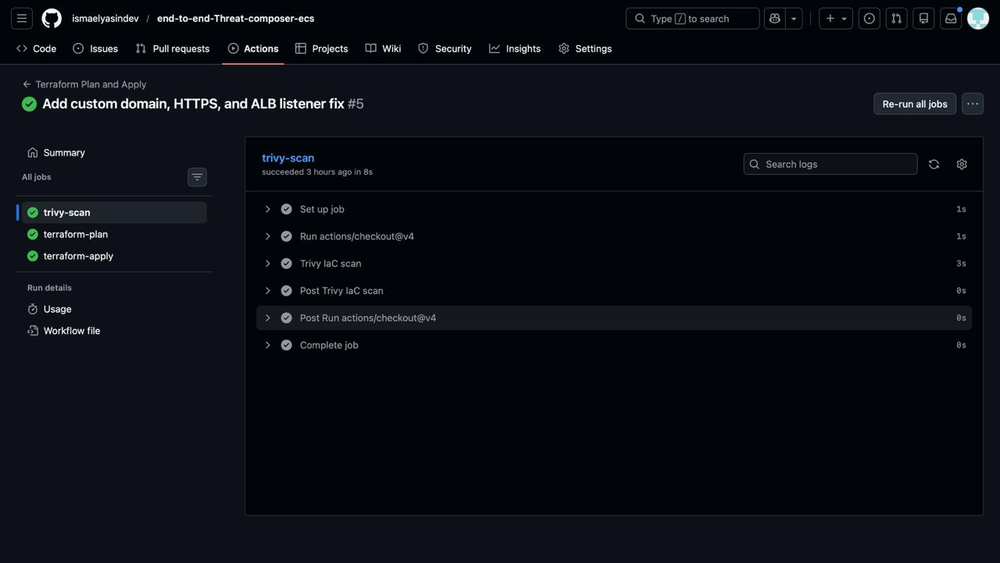
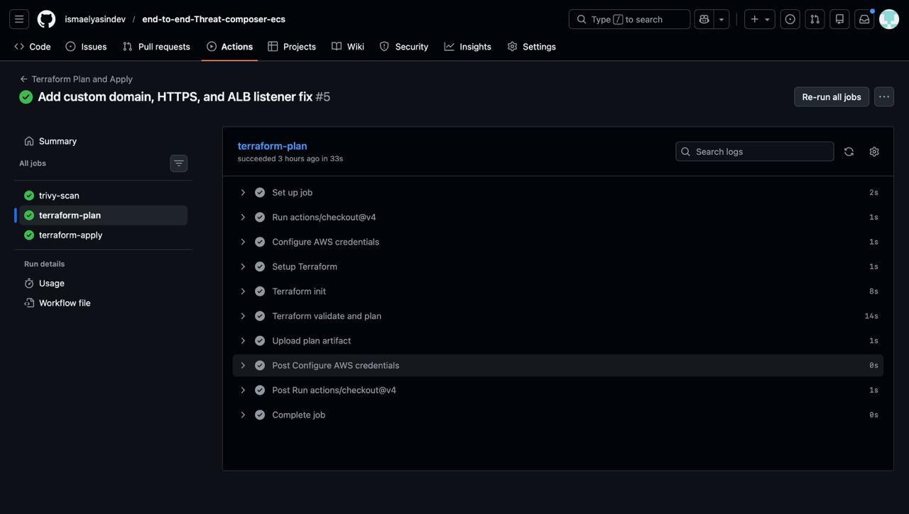
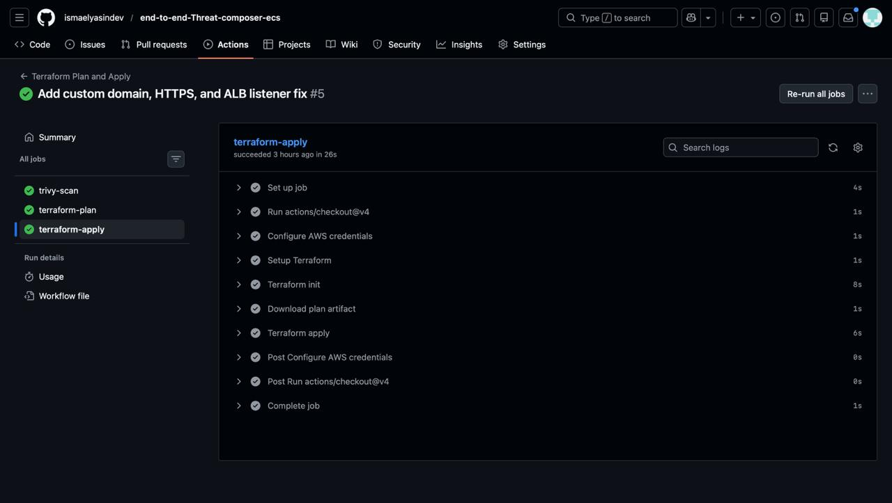
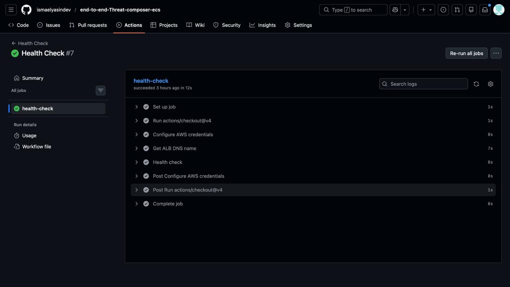

# Threat Composer ECS Deployment

A full stack web application for threat modelling and security assessments. This project demonstrates modern cloud infrastructure deployment using AWS services, containerisation with Docker, and automated CI/CD pipelines with GitHub Actions. The application is based on Amazon's open source Threat Composer tool, designed to facilitate threat modelling and improve security assessments.

## Live Application

The application is deployed and accessible at:

[https://threat.ismaelawsdashboard.site](https://threat.ismaelawsdashboard.site)

## Overview

This project showcases a production ready deployment of a React frontend threat modelling application on AWS infrastructure. The application enables users to create threat models, define architectures with data flow diagrams, document assumptions and mitigations, and generate threat statements. The entire infrastructure is managed through Terraform, and deployments are automated through GitHub Actions workflows.

## Architecture

The system follows a containerised architecture pattern with clear separation between the static frontend and the serving layer. The infrastructure spans multiple availability zones for high availability, uses private subnets for security, and implements automated deployment and monitoring.


The deployment architecture includes:

**Developer Workflow**

Code changes pushed to GitHub trigger automated workflows that build Docker images, push them to ECR, and deploy infrastructure changes through Terraform. The Docker workflow runs when application code or Docker configuration changes, whilst the Terraform workflow runs when infrastructure code changes. A health check workflow verifies deployments after Terraform completes.

**User Access Flow**

Users access the application through Route 53 DNS resolution, which routes traffic through an Application Load Balancer with SSL termination via AWS Certificate Manager. The ALB distributes requests to ECS tasks running in private subnets across two availability zones.

**Infrastructure Components**

The VPC spans two availability zones (eu-west-2a and eu-west-2b) with public subnets hosting the load balancer and NAT gateway, whilst private subnets contain the application containers. This design ensures security through network isolation whilst maintaining internet connectivity for container image pulls from ECR.

## Technology Stack

**Frontend**

React with TypeScript for type safety and component based architecture. AWS Northstar (Cloudscape) design system for consistent UI components. React Flow for interactive data flow diagrams. Styled Components for styling. The application supports workspace management, threat statement generation, and diagram based architecture modelling.

**Infrastructure**

Terraform manages all AWS resources including VPC, ECS Fargate, Application Load Balancer, Route 53, ACM certificates, and security configurations. The infrastructure is modularised for maintainability with separate modules for VPC, security groups, ALB, ACM, and ECS.

**Containerisation**

Docker multi stage builds optimise image size and build time. The builder stage compiles the React application, and the runner stage serves static files through Nginx. Images are stored in ECR with immutable tags based on commit SHAs alongside a latest tag.

**CI/CD**

GitHub Actions workflows handle building and deployment. OIDC authentication provides secure AWS access without storing credentials. The Terraform workflow includes Trivy IaC scanning, plan approval via environment protection rules, and sequential apply.

**Monitoring**

CloudWatch collects logs from ECS tasks and metrics from the load balancer. Container Insights provides detailed ECS metrics. A custom CloudWatch dashboard aggregates key operational data.

## Features

The threat modelling application provides several capabilities:

**Threat Statement Generator** creates structured threat statements following industry standard formats with customisable templates and impacted asset selection.

**Architecture Diagrams** support interactive data flow modelling with drag and drop components including actors, processes, datastores, and trust boundaries. STRIDE based threat identification is integrated into the diagram workflow.

**Workspace Management** organises threat models into workspaces with dashboard views and workspace level insights.

**Assumptions and Mitigations** link assumptions to threats and mitigations, maintaining traceability across the threat model.

**Report Generation** exports threat models as formatted reports with application info, architecture overview, and threat summaries.

**Controls and Dataflows** document security controls and data flow relationships between components.

## Project Structure

```
threat-composer-ecs-deployment/
├── app/
│   ├── src/              # React frontend source code
│   ├── public/           # Static HTML files
│   └── nginx/            # Nginx configuration
├── asset/                # README assets (diagrams, screenshots, demo)
├── docker/
│   └── Dockerfile        # Multi stage Docker build
├── terraform/            # Terraform infrastructure code
│   ├── modules/          # Reusable Terraform modules
│   │   ├── vpc/          # VPC and networking
│   │   ├── sg/           # Security groups
│   │   ├── alb/          # Application Load Balancer
│   │   ├── acm/          # Route 53 and ACM
│   │   └── ecs/          # ECS cluster and service
│   └── *.tf              # Main configuration files
├── bootstrap/            # Bootstrap resources
│   ├── s3/               # Terraform state backend
│   └── ecr/              # ECR repository
└── .github/
    └── workflows/        # GitHub Actions CI/CD pipelines
```

## Getting Started

### Prerequisites

An AWS account with appropriate permissions, a domain name for Route 53, Terraform installed locally, Docker installed for local builds, and a GitHub repository with Actions enabled. You will need to configure an IAM role with OIDC trust for GitHub Actions.

### Initial Setup

Clone the repository and navigate to the bootstrap directory. Create the S3 bucket and DynamoDB table for Terraform state using the bootstrap/s3 configuration. Create the ECR repository using the bootstrap/ecr configuration. Configure GitHub repository variables with your AWS region, account ID, and the IAM role ARN for OIDC. Ensure your Route 53 hosted zone exists and an ACM certificate is issued for your domain. Copy the example variables file in the terraform directory and configure it with your domain name and ECR repository name. Initialise Terraform and apply the configuration to create all AWS resources.

### Deployment

After initial setup, deployments happen automatically. Push code to the main branch and GitHub Actions will build the Docker image when app or docker files change, push it to ECR, and optionally run the Terraform workflow when infrastructure files change. The Terraform workflow runs Trivy IaC scan, creates a plan, waits for manual approval through the production environment, and applies the changes. The health check workflow verifies the deployment succeeded by querying the application health endpoint.

## CI/CD Pipeline

The deployment pipeline consists of three workflows that run based on file changes and workflow completion.

**Deploy Workflow**

Builds the Docker image using a multi stage build process. The React application is compiled and optimised, then served by Nginx in the final image. The image is tagged with the commit SHA and latest, then pushed to ECR. Triggered on changes to app or docker paths.

**Apply Workflow**

Runs Trivy IaC scan on Terraform configuration. Executes Terraform plan to preview infrastructure changes. The plan is saved as an artifact and uploaded. After manual approval through the production environment, Terraform apply executes the changes. This ensures infrastructure modifications are reviewed before implementation. Triggered on changes to terraform path.







**Health Check Workflow**

Waits for the Terraform workflow to complete successfully, then retrieves the ALB DNS name and repeatedly checks the application health endpoint. The workflow retries up to five times with ten second intervals. If the health check passes, the deployment is considered successful.



## Demo


## Learning Curve and Challenges

Building this project involved learning several new concepts and overcoming various challenges.

**Infrastructure as Code**

Terraform was new territory. Understanding how to structure modules, manage state, and handle dependencies between resources required significant research and experimentation. The transition from manual AWS console operations to declarative infrastructure code was a major shift in thinking.

**Container Orchestration**

ECS Fargate abstracts away server management but introduces concepts like task definitions, service configurations, and container networking. Getting the networking right with public and private subnets, security groups, and load balancer target groups took multiple iterations.

**CI/CD Automation**

Setting up GitHub Actions workflows that securely access AWS without storing credentials was challenging. OIDC authentication required understanding IAM roles, trust policies, and GitHub's token system. Debugging workflow failures required learning to read logs effectively.

**Docker Multi Stage Builds**

Optimising Docker images whilst maintaining build speed required understanding multi stage builds. Getting the React build artefacts in the right location for Nginx to serve them correctly, and configuring the correct base path for client side routing, caused several deployment failures before resolution.

**Network Security**

Designing the VPC architecture with proper subnet isolation whilst maintaining necessary connectivity was complex. Understanding when to use NAT Gateway versus VPC Endpoints, and configuring security groups correctly, required deep diving into AWS networking documentation.

**State Management**

Managing Terraform state in S3 with DynamoDB locking required understanding remote backends and state locking mechanisms. Resolving state conflicts and understanding when to import existing resources versus creating new ones was a learning process.

## Future Improvements

Several enhancements could improve the project further.

**Database Integration**

Currently the application uses browser local storage. Integrating with a backend service and persistent storage would enable collaboration and data persistence across sessions. This would require implementing an API layer and choosing an appropriate database.

**Authentication and Authorization**

Adding user authentication would allow multiple users to access threat models securely. AWS Cognito could handle user management, and IAM policies could control access to different workspaces or features.

**Auto Scaling**

Implementing auto scaling based on CPU and memory metrics would handle traffic spikes automatically. This would require configuring ECS service auto scaling and setting appropriate scaling policies.

**Multi Environment Support**

Supporting development, staging, and production environments would improve the deployment workflow. This could involve environment specific Terraform workspaces and separate GitHub environments for each stage.

**Enhanced Monitoring**

Adding more detailed CloudWatch dashboards and custom metrics would provide better visibility into application performance. Implementing SNS alerts for health check failures would improve operational awareness.

**Cost Optimisation**

Reviewing NAT Gateway usage and considering VPC Endpoints for ECR and S3 could reduce data transfer costs. Right sizing ECS task CPU and memory based on actual usage would optimise compute spend.

**Testing**

Adding automated tests for the React application would improve code quality. Unit tests and integration tests would catch issues before deployment. The Terraform workflow already includes Trivy IaC scanning for infrastructure security.

**Documentation**

Expanding documentation with architecture decision records and operational runbooks would help with maintenance. API documentation and deployment guides would make the project more accessible to contributors.

## Infrastructure Details

The infrastructure is designed for production use with high availability and security in mind.

**Networking**

The VPC spans two availability zones for redundancy. Public subnets host the load balancer and NAT gateway, whilst private subnets contain application containers. This design isolates application code from direct internet access whilst maintaining necessary connectivity for ECR image pulls.

**Compute**

ECS Fargate runs containerised tasks without managing servers. The service maintains two tasks across availability zones. The service automatically replaces unhealthy tasks and maintains the desired count. Resource limits prevent any single task from consuming excessive resources.

**Load Balancing**

The Application Load Balancer distributes traffic across tasks in both availability zones. Health checks on the /health endpoint ensure only healthy tasks receive traffic. HTTPS is enforced with automatic HTTP to HTTPS redirection. The target group forwards requests to the container port 8080.

**Security**

Security groups restrict network traffic to necessary ports only. The ALB security group allows inbound 80 and 443 from the internet and outbound 8080 to the task security group. The task security group allows inbound 8080 from the ALB only and outbound 443 for ECR and other AWS API calls. IAM roles follow least privilege principles. Private subnet isolation prevents direct internet access to application containers.

**Monitoring**

CloudWatch collects application logs from ECS tasks to the /ecs/threat-app log group. ALB metrics provide request counts and latency data. Container Insights provides detailed ECS metrics. A custom dashboard aggregates key operational data for troubleshooting.

## License

Apache 2.0
